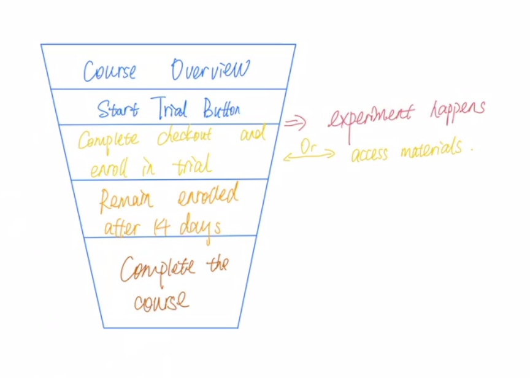

# ABTesting_Project
Final Project for A/B Testing Course

# Experiment Overview: Free Trial Screener

Control: Udacity courses have two options on the course overview page: "start free trial", and "access course materials". 
- If the student clicks "start free trial", they will be asked to enter their credit card information, and then they will be enrolled in a free trial for the paid version of the course. After 14 days, they will automatically be charged unless they cancel first. 
- If the student clicks "access course materials", they will be able to view the videos and take the quizzes for free, but they will not receive coaching support or a verified certificate, and they will not submit their final project for feedback.

Experiment: Udacity tested a change where if the student clicked "start free trial", they were asked how much time they had available to devote to the course. 
- If the student indicated 5 or more hours per week, they would be taken through the checkout process as usual. 
- If they indicated fewer than 5 hours per week, a message would appear indicating that Udacity courses usually require a greater time commitment for successful completion, and suggesting that the student might like to access the course materials for free. At this point, the student would have the option to continue enrolling in the free trial, or access the course materials for free instead. 
This screenshot shows what the experiment looks like.

Hypothesis: this might set clearer expectations for students upfront, thus reducing the number of frustrated students who left the free trial because they didn't have enough time—without significantly reducing the number of students to continue past the free trial and eventually complete the course. 
- If this hypothesis held true, Udacity could improve the overall student experience and improve coaches' capacity to support students who are likely to complete the course.

# Experiment Design

## Unit of diversion
The unit of diversion is a cookie, although if the student enrolls in the free trial, they are tracked by user-id from that point forward. The same user-id cannot enroll in the free trial twice. For users that do not enroll, their user-id is not tracked in the experiment, even if they were signed in when they visited the course overview page.

## Metric Choice
### Customer Funnel

### Invariant Metrics
> **Sanity check** can help check whether there’re things going wrong by looking at invariant metrics. There're two types of invariant metrics:
(1) population sizing metrics based on unit of diversion: experiment population and control population should be comparable.
(2) other invariants: the metrics that shouldn’t change in your experiment. We can check where the invariant metric falls under the overall process. If the feature affects the 2nd step in the customer funnel, then the metrics happens before the 2nd step can be used as invariant metrics.

**Number of Cookies**: number of unique cookies to visit the course overview page. This is the unit of diversion and should be even distributed among the control and experiment groups.

**Number of Clicks**: number of unique cookies to click the "Start free trial" buttion (which happens before the free trial screener is trigger). This metric is tracked before the experiment is triggered. So it should be comparable between the experiment and control groups.

**Click-through-probability**: number of unique cookies to click the "Start free trial" button divided by number of unique cookies to view the course overview page. This metric is also tracked before the experiment is triggered. So it should be comparable between the experiment and control groups.

### Evaluation metrics

> To evaluate the performance of the experiment, we should firstly choose a good metric, which can happen in any steps of the customer funnel after the experiment is triggered. Recall that the goal of the experiment is reducing the number of left students and encouraging more students to continue past the free trial. 

To examine whether we can reach the goal in the experiment, our metrics should be in a rate or probability form, containing the following factors, which will change after the experiment and can impact our hypothesis: 
- number of user-ids to enroll in the free trial (this is expected to decrease)
- number of user-ids to past the free-trial (this should not decrease significantly)
- number of user-ids who complete the course (hope this wil; increase)

Therefore, our final evaluation metrics are:

**Gross conversion**: number of user-ids to complete checkout and enroll in the free trial divided by number of unique cookies to click the "Start free trial" button.
(dmin = 0.01)

**Retention**: number of user-ids to remain enrolled past the 14-day boundary (and thus make at least one payment) divided by number of user-ids to complete checkout. (dmin = 0.01)

**Net conversion**: number of user-ids to remain enrolled past the 14-day boundary (and thus make at least one payment) divided by the number of unique cookies to click the "Start free trial" button. (dmin = 0.0075)

All the metrics have a predetermined practical significant value (dmin) which should be reached if we want to launch the experiment. 

# Measuring Variability

For each metric you selected as an evaluation metric, estimate its standard deviation analytically, given a sample size of 5000 cookies visiting the course overview page. Do you expect the analytic estimates to be accurate? That is, for which metrics, if any, would you want to collect an empirical estimate of the variability if you had time?

Our three metrics are all in the form of probability, so we can assume them to be binomial distribution and used the formula to calculate the standard deviation of the sampling distribution for the proportion, or standard error:

\begin{align}
\sqrt{\frac{P*(1-P)}{N}}
\end{align}

Due to different unit of analysis these three metrics use, we should firstly calculate the number of unit of analysis. 
- For **gross conversion** and **net conversion**, the unit of analysis is the number of unique cookies who click the button. In the baseline group, 40000 pageviews correspond to 3200 click on the button. 
- For **retention**, the unit of analysis is number of users who complete checkout. In the baseline group, 40000 pageviews correspond to 660 checkouts and enrollments.

The calculation is based on the [baseline data]()

**_Analytical Estimate of Standard Deviation_**

| Evaluation Metric | Standard Deviation |
|:-------------------:|:--------------------:|
| Gross Conversion  | 0.0202 |
| Retention         | 0.0549 |
| Net Conversion    | 0.0156 |

- For gross conversion and net conversion, their unit of analysis is the same as their unit of diversion, and therefore, their actual variability will be similar to the calculated variability. 
- For retention, its unit of analysis is different from its unit of diversion, which means the actual variability might be a lot higher than what was calculated analytically.

# Calculating Sample Size

I won't use Bonferroni correction in my analysis phase. To decide the total number of pageviews I need, I'll set alpha = 0.05 and beta = 0.2.

The formula for sample size is:

As from the formula:
- z-beta = 0.84, if 1 - beta = 0.8
- z-alpha/2 = 1.96, if alpha = 0.05
- Standard deviation follows the formula that: ${SE}$ = $\frac{SD}{\sqrt{N}}$, which means we assume that the standard error is proportional to $\frac{1}{\sqrt{N}}$.

So I'll use the formula to firstly calculate the needed sample size, and then decide the total number of pageview needed.

**_Sample Size Calculation_**

| Evaluation Metric | Sample Size Needed| Pageviews Needed | Days Needed to Gather Pageviews with 50% Traffic|
|:-------------------:|:--------------------:|:--------------------:|:--------------------:|
| Gross Conversion  | 51398 | 642475 | 237 |
| Retention         | 78206 | 4739757 | 32 |
| Net Conversion    | 54343 | 679287 | 34 |
